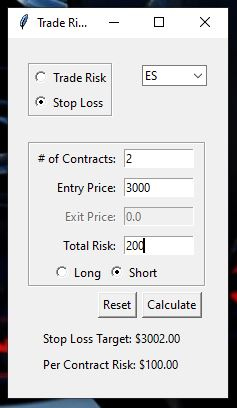

# Trade Risk Calculator

### Objective
Create an app to determine risk on a commodity trade.  

#### Idea
Futures contracts have different tick sizes and tick values.  Unless very familar with this information it has to be looked up so that risk on a trade can be calculated.  This calculator will allow a user to calculate risk without knowing tick sizes or tick values.

There will be two different ways to determine trade risk:
- get total risk for a trade based on entry price, stop loss target, and the number of contracts
- get stop loss target for trade based on entry price, desired total trade risk, and the number of contracts

#### Inital Plan
I planned to use Python along with Panel to build an interactive calclulator then use AWS or Heroku to host the finished product.

#### Final Outcome
I was able to get tick size and tick value data from barchart.com and cmegroup.com to build the dictionary for the calculator to use in the calculations.  I was able to build the panel dashboard but ran into an issue loading it on Heroku due to my limited experience with it.

I pivoted the project to building a GUI with python's tkinter library that could be converted to an executable file and ran locally.  Completing the project in this manner would allow for user to be able to access the app without having to download python or any of it's libraries to their computer.

#### The App

* Initial screen when opened

    

&nbsp;

* To get the total risk on a trade.....Select 'Trade Risk', the ticker symbol from the drop down list, enter # of contracts, entry price and exit price then click the calculate button.  The output will show the total risk and the per contract risk as show below.

     

&nbsp;

* To get a stop loss target.....Select "Stop Loss", the ticker symbol from the drop down list, enter # of contracts, entry price, total risk willing to be taken on the trade, select if the trade is a long or short side trade then click the calculate button.  The output will show the stop loss target and per contract risk as shown below.

      
    
#### Technologies Used
- Python
- tkinter library
- Pyinstaller

#### Challenges
- Getting the app to work using a panel dashboard
- Getting the app in a format that could be uploaded to Heroku

[Click here](updates_and_futures_changes.txt) to see working log and future changes for the application.